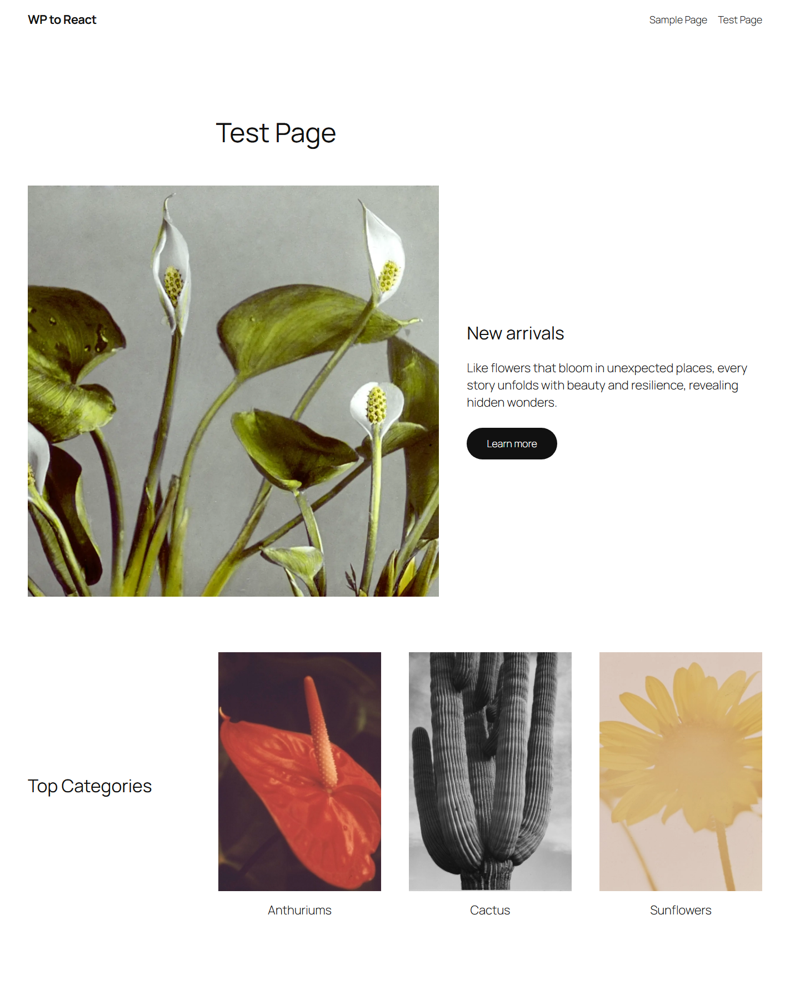
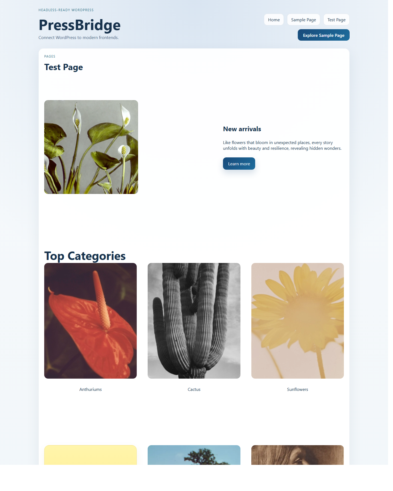
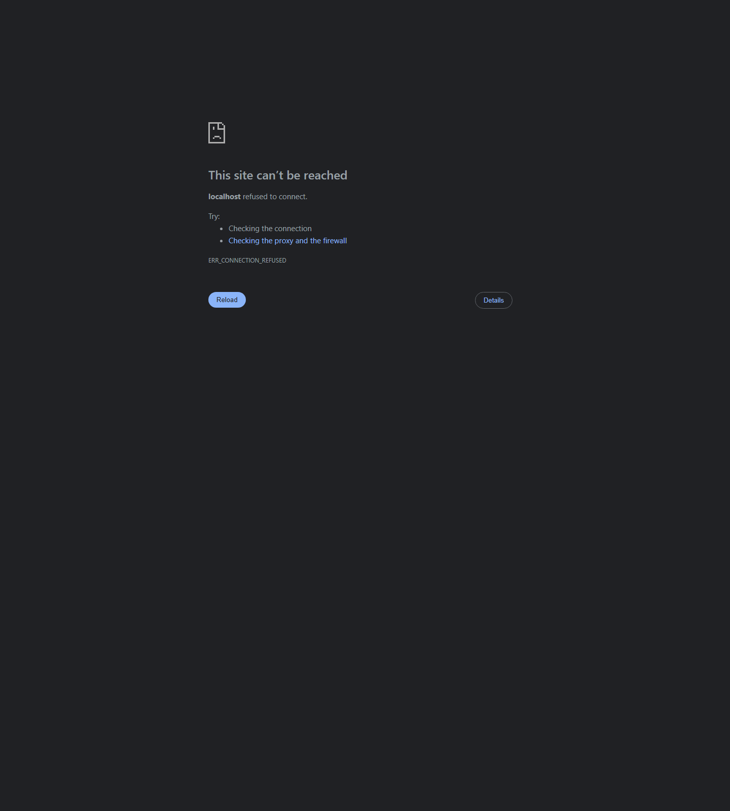

# PressBridge

Connect WordPress to modern frontends.

Keep WordPress as your CMS. Upgrade your frontend to React.

PressBridge is a WordPress plugin that keeps WordPress as the CMS while React renders the frontend.

## Before vs After

| WordPress default rendering | PressBridge React rendering |
| --- | --- |
|  |  |

Left: WordPress default rendering  
Right: PressBridge React rendering

Same content. Two frontends.

Both views use the same WordPress content. PressBridge improves layout, structure, and frontend experience using React.

**Same WordPress content. Better frontend.**

Homepage screenshot:



## What is PressBridge

PressBridge is a WordPress plugin plus an optional React starter frontend.

WordPress still manages the content, previews, menus, and permalink truth. PressBridge adds the plugin layer that resolves routes, exposes React-friendly data, and hands public traffic to a modern frontend when you are ready.

This repository contains:

- the WordPress plugin
- a Vite React frontend for normal development
- a lightweight no-build React frontend for quick smoke testing
- the starter frontend template exported by the plugin

## Why it exists

WordPress is strong as a CMS, but the default frontend model can be limiting when you want a more modern UI layer. Fully headless WordPress setups can also add too much complexity too early: custom routing, brittle previews, and more integration work than many teams need.

PressBridge exists to simplify that bridge. It keeps WordPress where WordPress is strong and adds a safer path to a React frontend.

## How it works

```text
WordPress (CMS)
  ->
PressBridge (Plugin Layer)
  ->
React Frontend
```

High-level flow:

1. WordPress remains the source of truth for content and editorial workflows.
2. PressBridge exposes normalized data and resolves what a route means.
3. React renders the public-facing experience.

## Features

- Headless mode toggle with safe fallback behavior
- Configurable frontend app URL
- Public redirect handoff for logged-out visitors
- Safe bypass for `wp-admin`, login, REST, AJAX, cron, and logged-in editors
- Custom REST namespace for site config, menus, content, route resolution, and previews
- Signed preview links for cross-domain frontend previews
- `View in React` shortcuts for logged-in users
- React starter export
- Gutenberg-aware content rendering with safe fallback for unsupported blocks
- HTML fallback path for shortcode-heavy content when block rendering is not the right fit

## How PressBridge is different

Typical headless WordPress setups often mean:

- custom setup
- brittle preview flow
- routing logic spread across the frontend

PressBridge takes a more practical path:

- plugin-based bridge layer
- safe fallback behavior
- easier adoption for real editorial sites

## Quick Start

1. Install and activate `PressBridge` in WordPress.
2. Open `Settings > PressBridge` and set the frontend URL to `http://localhost:5173`.
3. Run the frontend:

For the normal React dev flow:

```powershell
cd frontend-app
npm install
npm run dev
```

For a fast smoke-test frontend:

```powershell
cd frontend-lite
python server.py
```

4. Test the bridge:

- `http://wp-to-react.local/wp-json/pressbridge/v1/site`
- `http://wp-to-react.local/wp-json/pressbridge/v1/resolve?path=/`
- `http://localhost:5173/`

5. When routes are rendering correctly, enable headless mode and switch route handling to redirect mode.

## Architecture Overview

PressBridge has three layers:

- `WordPress`
  - content, publishing, previews, menus, permalink truth
- `PressBridge plugin`
  - settings, route resolution, preview tokens, normalized REST endpoints, safe public handoff
- `React frontend`
  - layout, rendering, navigation, and public UX

Key repo areas:

- [includes](includes)
  - plugin PHP classes
- [frontend-app](frontend-app)
  - Vite React app for normal development
- [frontend-lite](frontend-lite)
  - no-build smoke-test frontend
- [assets/starter](assets/starter)
  - starter frontend template exported by the plugin
- [docs](docs)
  - local workflow, smoke tests, release readiness notes

## Example Use Cases

- Upgrade a WordPress site to a React frontend without throwing away the editorial workflow
- Build a headless WordPress project without starting from a blank API integration
- Give an agency team a safer "WordPress backend + React frontend" baseline to build from

## Limitations

PressBridge is still an alpha, and this repo is honest about that.

- It does not aim to clone the active WordPress theme pixel-for-pixel
- Gutenberg block fidelity is improving, but it is still a translation layer into a React-side design system
- No ACF integration yet
- WooCommerce is currently an advanced compatibility path, not a default starter feature
- WooCommerce cart and checkout flows are easiest when the public frontend and store share the same primary domain
- No authenticated frontend/session bridge yet
- No SSR or Next.js integration yet
- `frontend-lite` is for smoke testing, not the long-term production frontend structure

## Roadmap

Planned or likely next areas, not promises:

- Gutenberg mapping improvements
- Elementor support
- WooCommerce compatibility layer

## Demo

Video placeholder:

- `docs/videos/pressbridge-demo.mp4`

Live demo behavior in this repo already shows the main idea:

- Same WordPress content. Better frontend.
- WordPress still controls content, routing truth, and previews
- the frontend can improve layout and UX without replacing WordPress admin

## Who this is for

- Developers who want a cleaner WordPress-to-React bridge
- Agencies upgrading WordPress frontends without breaking editorial workflows
- Technical WordPress users who want a safer headless path than "replace everything at once"

## Who this is not for

- Teams looking for a no-code site builder
- Projects that need full WordPress theme parity out of the box
- Teams expecting WooCommerce, ACF, or SSR support today

## Supporting Docs

- [Local development flow](docs/local-dev.md)
- [MVP smoke test](docs/mvp-smoke-test.md)
- [Release checklist](docs/release-checklist.md)
