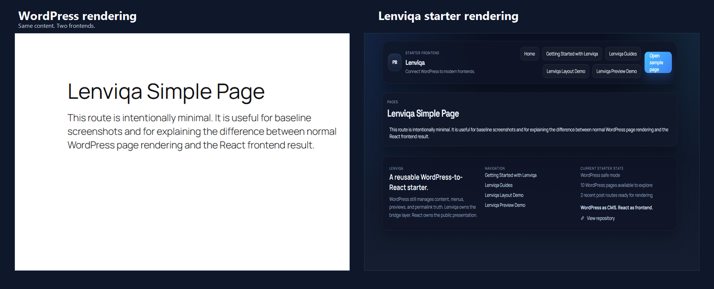
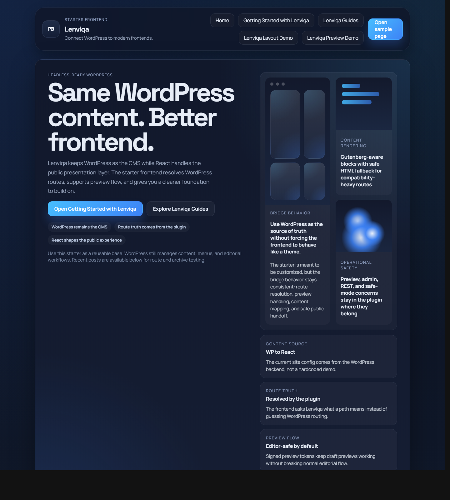
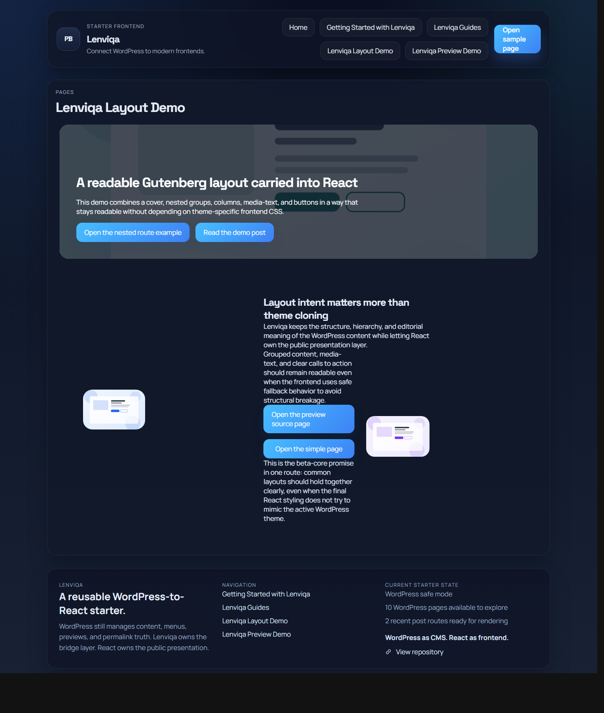
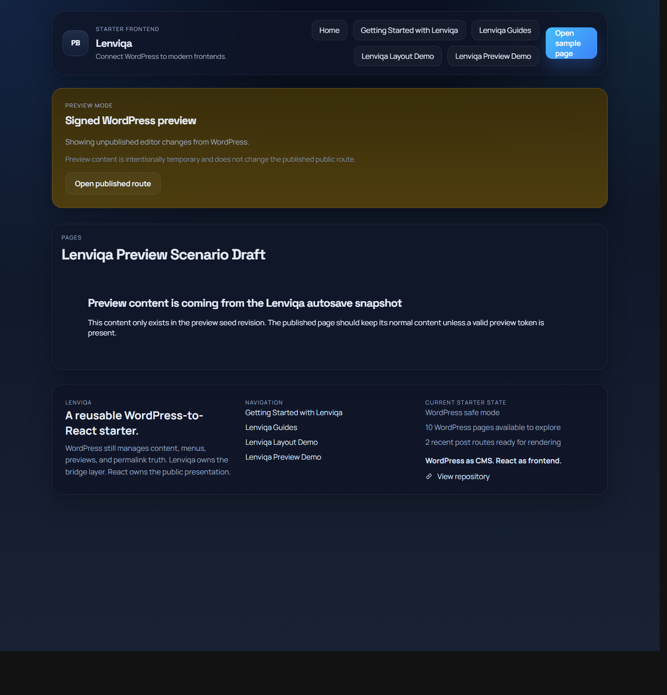
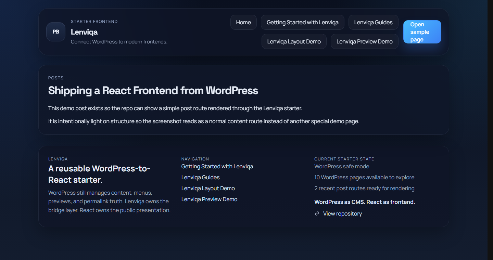

# Lenviqa

Lenviqa helps developers use WordPress as a CMS while React handles the public frontend.

It is a WordPress plugin plus starter frontends with validated support for:

- common route resolution
- common Gutenberg layout handling
- preview-flow foundations
- repeatable package/install/runtime confidence

This repo is for developers evaluating a practical WordPress-to-React bridge, not a theme-cloning system.

## Beta Status

Lenviqa is currently released as a beta core.

That means the current public promise is limited to the validated core scope:

- route scenarios
- Gutenberg scenarios
- preview guardrails
- packaging/install/runtime validation

See [Beta scope](docs/beta-scope.md) for the validated boundary and [v0.2.0 release notes](docs/release-notes-v0.2.0.md) for the first beta release notes.

## Who This Is For

- developers who want WordPress content and editorial workflows without building a bridge from scratch
- agencies or product teams that want a safer WordPress backend + React frontend baseline
- technical WordPress teams that want preview, routing, and starter structure handled more consistently

## Why It Exists

Rolling your own headless WordPress bridge usually means re-solving the same problems repeatedly:

- route truth spread across frontend code
- brittle preview behavior
- unclear fallback behavior when content gets messy
- more packaging and setup drift across projects

Lenviqa takes a narrower approach:

- WordPress stays the CMS
- Lenviqa owns the bridge layer
- React owns the public presentation layer

```text
WordPress (CMS + editorial backend)
  ->
Lenviqa (route + preview + bridge layer)
  ->
React frontend (public presentation)
```

## Visual Proof

### Same content. Two frontends.



Caption:
- Same content. Two frontends.

### A starter frontend is included so you are not beginning from a blank bridge.



Caption:
- A starter frontend is included so you are not beginning from a blank bridge.

### Common Gutenberg layouts render with stable structure and safe fallback behavior.



Caption:
- Common Gutenberg layouts render with stable structure and safe fallback behavior.

### Preview content through the frontend without breaking editorial flow.



Caption:
- Preview content through the frontend without breaking editorial flow.

### Resolve nested WordPress routes without guessing in the frontend.


Caption:
- Resolve nested WordPress routes without guessing in the frontend.

### Normal WordPress pages and posts still resolve cleanly through the bridge.



Caption:
- Normal WordPress pages and posts still resolve cleanly through the bridge.

The exact capture plan lives in [Repo screenshot plan](docs/repo-screenshot-plan.md).

## What Core Currently Handles

The current beta-safe boundary is defined in [Beta scope](docs/beta-scope.md).

In practical terms, core currently handles:

- route resolution for:
  - home route
  - standard page routes
  - nested hierarchical page routes
  - standard post routes
  - unresolved-route honesty
  - basic path normalization
- Gutenberg-aware rendering for common layout patterns:
  - nested groups
  - columns inside groups
  - media-text recovery from saved markup
  - cover sections with inner content
  - gallery fallback from saved markup
  - button-group layout intent
- preview foundations:
  - signed preview token resolution
  - honest invalid/expired preview failure
  - preview content staying separate from normal public routing
- package/install/runtime confidence:
  - plugin ZIP builds repeatably
  - package structure validates
  - activation defaults seed correctly
  - starter export hook registration is present
  - deactivation and uninstall behavior have runtime checks

## What Core Does Not Promise

Lenviqa core does not currently promise:

- WooCommerce as a solved core feature
- ACF integration
- Elementor compatibility
- theme-specific CSS fidelity
- pixel-perfect Gutenberg parity with the active WordPress theme
- support for third-party/custom block ecosystems
- support for interactive blocks that rely on WordPress frontend JS
- full frontend parity between the main starter and the lightweight smoke frontend

Those boundaries are intentional. The current promise is stable bridge behavior, not universal WordPress frontend parity.

## Quick Start

1. Build or install the plugin ZIP.
2. Activate Lenviqa in WordPress.
3. Open `Settings > Lenviqa`.
4. Set the frontend URL to `http://localhost:5173`.
5. Run the main starter:

```powershell
cd frontend-app
npm install
npm run dev
```

6. Verify:

- `http://wp-to-react.local/wp-json/pressbridge/v1/site`
- `http://wp-to-react.local/wp-json/pressbridge/v1/resolve?path=/`
- `http://localhost:5173/`

For a lightweight smoke frontend:

```powershell
cd frontend-lite
python server.py
```

## Supporting Docs

### Release and scope

- [Beta scope](docs/beta-scope.md)
- [v0.2.0 release notes](docs/release-notes-v0.2.0.md)
- [Current feature status](docs/current-feature-status.md)
- [Core roadmap](docs/core-roadmap.md)

### Validation and proof

- [Repo screenshot plan](docs/repo-screenshot-plan.md)
- [Route scenario matrix](docs/route-scenario-matrix.md)
- [Gutenberg scenario matrix](docs/gutenberg-scenario-matrix.md)
- [Preview scenario matrix](docs/preview-scenario-matrix.md)
- [Packaging and install confidence](docs/packaging-install-confidence.md)

### Onboarding and wiki

- [First-time onboarding](docs/first-time-onboarding.md)
- [Local development](docs/local-dev.md)
- [Wiki plan](docs/wiki-plan.md)
- [Wiki: What is Lenviqa](docs/wiki-what-is-pressbridge.md)
- [Wiki: Quick start](docs/wiki-quick-start.md)
- [Wiki: Supported beta scope](docs/wiki-supported-beta-scope.md)
- [Wiki: Limitations and non-goals](docs/wiki-limitations-and-non-goals.md)

### Release communication

- [Public announcement drafts](docs/public-announcement-drafts-v0.2.0.md)
