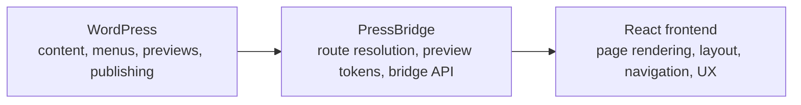

# PressBridge

Connect WordPress to modern frontends.

PressBridge helps you keep WordPress as your CMS while upgrading the public frontend to React. It handles route resolution, preview flow, and safe frontend handoff without breaking normal editorial workflows.

Primary value: `Same WordPress content. Better frontend.`

## What is PressBridge

PressBridge is a WordPress plugin plus an optional React starter frontend.

WordPress still manages the content, publishing workflow, previews, menus, and permalink truth. PressBridge adds the bridge layer that exposes React-friendly data, resolves WordPress routes, and hands public traffic to a modern frontend when you are ready.

This repository contains:

- the WordPress plugin
- a Vite React frontend for normal development
- a lightweight no-build React frontend for quick smoke testing
- the starter frontend template exported by the plugin

## Why it exists

Typical WordPress headless setups often ask you to replace too much at once. You lose familiar preview behavior, route handling gets fragile, and editorial workflows can become harder instead of better.

PressBridge exists to make that upgrade path less brittle.

It lets developers keep WordPress where WordPress is strong, while moving the public experience to React in a way that stays practical for agencies, technical site owners, and teams maintaining real editorial sites.

## Before vs After

### Default WordPress frontend

- WordPress manages content and renders the public site through the active theme
- frontend changes often live in PHP templates and theme CSS
- upgrading UX or interaction patterns can mean working around theme constraints

### PressBridge React frontend

- WordPress still manages the content
- PressBridge resolves routes, previews, and frontend handoff
- React renders the public experience with a cleaner component-based frontend layer

Screenshot placeholders:

- WordPress version: [docs/images/wp-version.png](docs/images/wp-version.png)
- PressBridge version: [docs/images/pressbridge-version.png](docs/images/pressbridge-version.png)

## How it works



High-level flow:

1. WordPress remains the source of truth for content and editorial workflows.
2. PressBridge exposes normalized data and resolves what a route means.
3. React renders the public-facing experience.

## Features

Only features that currently exist in this repo are listed here.

- Headless mode toggle with safe fallback behavior
- Configurable frontend app URL
- Public redirect handoff for logged-out visitors
- Safe bypass for `wp-admin`, login, REST, AJAX, cron, and logged-in editors
- Custom REST namespace for site config, menus, pages, posts, generic items, content by slug, route resolution, and previews
- Signed preview token flow for cross-domain frontend previews
- `View in React` shortcuts for logged-in users
- React starter export
- Gutenberg-aware content rendering with safe fallback for unsupported blocks

## Quick Start

### 1. Install the plugin

- Install the plugin in WordPress
- Activate `PressBridge`
- Open `Settings > PressBridge`

### 2. Set the frontend URL

For local development, use:

- `http://localhost:5173`

Leave route handling in WordPress mode until the frontend is rendering pages and previews correctly.

### 3. Run the frontend

For the normal React dev flow:

```powershell
cd frontend-app
npm install
npm run dev
```

For a fast smoke-test frontend:

```powershell
cd frontend-lite
python server.py
```

### 4. Test the bridge

Check these first:

- `http://wp-to-react.local/wp-json/pressbridge/v1/site`
- `http://wp-to-react.local/wp-json/pressbridge/v1/resolve?path=/`
- `http://localhost:5173/`

### 5. Enable handoff when ready

Once the frontend is rendering routes correctly:

- enable headless mode
- switch route handling to redirect mode
- verify logged-out public traffic is handed to React

## Architecture Overview

PressBridge has three layers:

- `WordPress`
  - content, publishing, previews, menus, permalink truth
- `PressBridge plugin`
  - settings, route resolution, preview tokens, normalized REST endpoints, safe public handoff
- `React frontend`
  - layout, rendering, navigation, and public UX

Key repo areas:

- [includes](includes)
  - plugin PHP classes
- [frontend-app](frontend-app)
  - Vite React app for normal development
- [frontend-lite](frontend-lite)
  - no-build smoke-test frontend
- [assets/starter](assets/starter)
  - starter frontend template exported by the plugin
- [docs](docs)
  - local workflow, smoke tests, release readiness notes

## Example Use Cases

- Upgrade a WordPress site to a React frontend without throwing away the editorial workflow
- Build a headless WordPress project without starting from a blank API integration
- Give an agency team a safer "WordPress backend + React frontend" baseline to build from

## Limitations

PressBridge is still an alpha, and this repo is honest about that.

- It does not aim to clone the active WordPress theme pixel-for-pixel
- Gutenberg block fidelity is improving, but it is still a translation layer into a React-side design system
- No ACF integration yet
- No WooCommerce integration yet
- No authenticated frontend/session bridge yet
- No SSR or Next.js integration yet
- `frontend-lite` is for smoke testing, not the long-term production frontend structure

## Roadmap

Planned or likely next areas, not promises:

- Gutenberg mapping improvements
- Elementor support
- WooCommerce support

## Demo

Video placeholder:

- `docs/videos/pressbridge-demo.mp4`

Live demo behavior in this repo already shows the main idea:

- the same WordPress content can be rendered through a React frontend
- WordPress still controls content, routing truth, and previews
- the frontend can improve layout and UX without replacing WordPress admin

## Who this is for

- Developers who want a cleaner WordPress-to-React bridge
- Agencies upgrading WordPress frontends without breaking editorial workflows
- Technical WordPress users who want a safer headless path than "replace everything at once"

## Who this is not for

- Teams looking for a no-code site builder
- Projects that need full WordPress theme parity out of the box
- Teams expecting WooCommerce, ACF, or SSR support today

## Supporting Docs

- [Local development flow](docs/local-dev.md)
- [MVP smoke test](docs/mvp-smoke-test.md)
- [Release checklist](docs/release-checklist.md)
